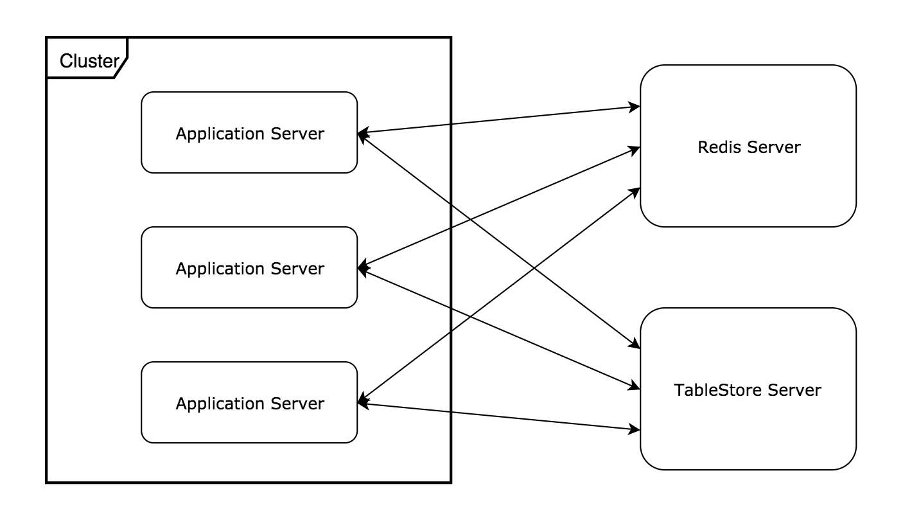
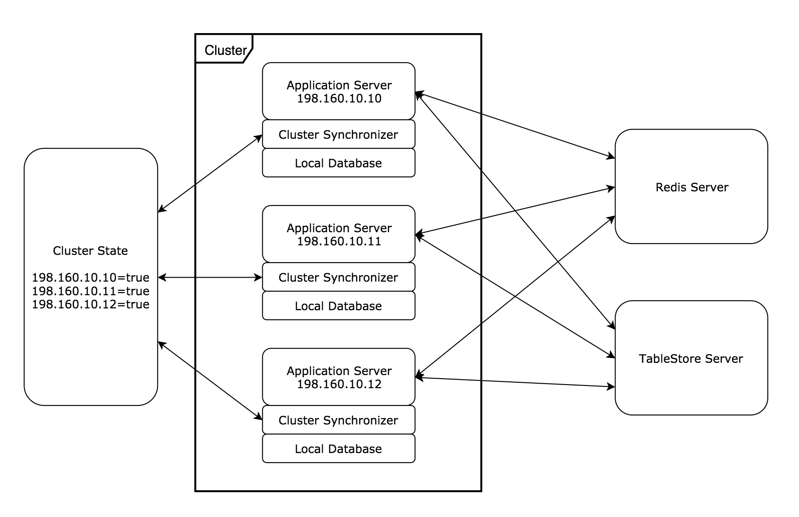
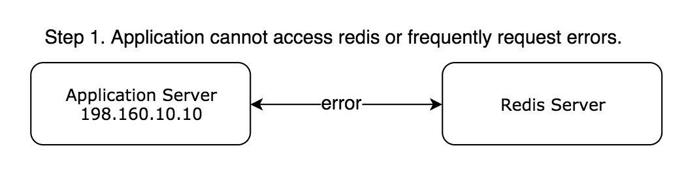
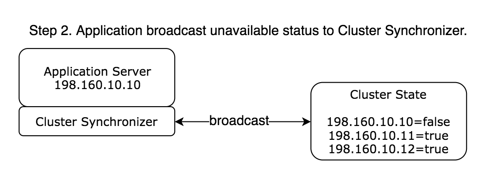
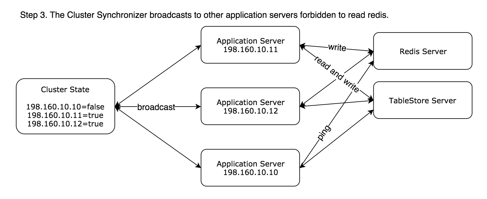
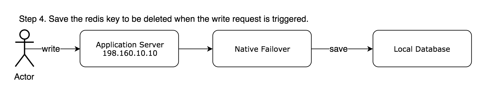
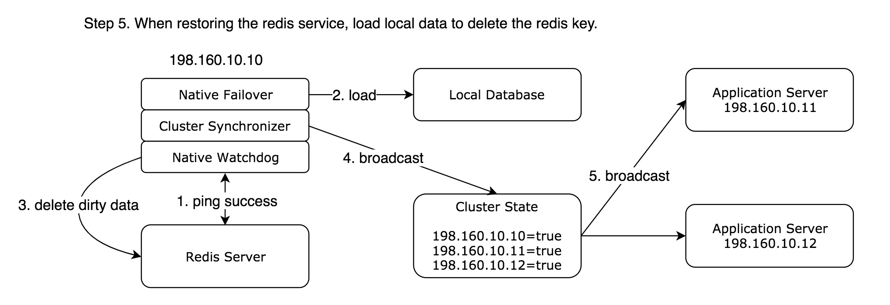
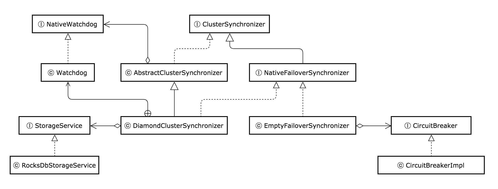

# Redissto

## 背景

使用 Redis 和 TableStore 做非同源存储容灾。基础架构如下：

当 TableStore 不可用时，Application Server 能够使用 Redis 的节点配置数据完成节点入网、上下行和数据流转。但是多了一层存储服务 Redis，会给系统的可靠性带来问题：如果某台服务器因为网络抖动导致无法访问 Redis。但此时发生了写记录，由于不能及时删除 Redis 的数据，可能导致下一时刻，另外一台可以访问 Redis 的服务器读取到脏数据。

为了解决这个问题，我们可以使用本地存储或者其他方式保存这个待删除的 Redis Key。但是如果我们引用了本地存储，又会带来另外一个问题：当 Redis 不可用时，所有执行的写操作都会失败。如果删除操作不断地执行，在分布式集群下，每台服务器会具有不同数量的删除失败记录。如果某一台先执行完成本地记录的删除操作，而恢复了读取 Redis，仍然可能导致读取到脏数据。

## 架构设计

> Redissto是构建基于 Redis 的高可用分布式存储系统的框架。

Redissto 提供 **单点** 和 **集群** 的两种运行方式，**单点** 运行方式只支持断路器的功能，断路器流程如下：

 - 正常情况下，断路器关闭，允许请求下游服务
 - 下游服务不可用时或者频繁的请求失败达到一定阈值
   - 如果达到断路器半开阈值：允许部分请求，如果请求成功大于一定数量，断路器快速关闭，否则断路器全开
   - 如果达到断路器全开阈值：拒绝调用下游服务，一段时间后进入半开状态

而 **集群** 运行方式还额外支持故障转移和集群状态同步的功能。下图为 Redissto 在 **集群** 模式的示例：

当应用无法访问 Redis 或者频繁访问 Redis 失败时：

Cluster Synchronizer组件具有断路器的能力，此时会进入全开状态，拒绝请求继续调用 Redis，并推送"198.160.10.10服务器无法访问 Redis"。

在Cluster State发生配置变更时，会推送更新后的配置给其他监听的应用 Cluster Synchronizer。其他应用的 Cluster Synchronizer 将会关闭 **读** 请求访问 Redis，只允许 **写**请求 Redis。

如果有 **写** 请求访问`198.160.10.10`服务器时，由于 **写操作** 会直接被拒绝，将使用 Native Failover 存储待删除的 Redis Key。

`198.160.10.10`服务器会使用 Native Watchdog 看门狗不断地去执行`ping`命令，如果`ping`成功会使用 Native Failover 获取待删除的 Redis Keys，接着 Native Watchdog 看门狗会执行删除 Redis 的脏数据。一旦执行完成删除后，Cluster Synchronizer 会推送"198.160.10.10服务器正常访问 Redis"，这样整个集群都可以恢复读 Redis。

## 组件介绍

Redissto 提供了可扩展的`ClusterSynchronizer`集群同步器、`NativeWatchdog`看门狗和`StorageService`存储服务。

### 集群同步器

`ClusterSynchronizer`集群同步器用于推送和监听集群的状态`clusterState`，同时还需要维护本地服务器是否读写的状态`nativeState`。Redissto 提供了`AbstractClusterSynchronizer`抽象类，通过继承该类可以不用关心状态的转换。`AbstractClusterSynchronizer`的本地状态`nativeState`有以下四种：

 - `CLOSE`：集群同步器默认关闭，允许执行写请求。
 - `HALF_OPEN`：写请求失败频率达到半开阈值，允许执行部分写请求，如果请求成功大于一定数量，将调整为`CLOSE`状态。
 - `OPEN`：写请求失败频率达到全开阈值，拒绝写请求，启动`NativeWatchdog`看门狗去尝试恢复重连。
 - `WAIT_CLOSE`：当`NativeWatchdog`看门狗尝试恢复重连成功时，此时将由`OPEN`变为`WAIT_CLOSE`。`NativeWatchdog`看门狗开始去执行恢复服务，当恢复完成时，状态由`WAIT_CLOSE`变为`CLOSE`，同时`NativeWatchdog`看门狗关闭。

目前 Redissto 使用了 Diamond 中间件存储了集群状态，`redissto-diamond`模块提供的`DiamondClusterSynchronizer`可以开箱即用。如果想要扩展您自己的`ClusterSynchronizer`集群同步器，需要注意以下方法：

 1. `broadcast(boolean)`：广播本地服务器的状态；
 2. `nativeState()`：获取本地状态，是否允许读请求 Redis，用于判断本地状态是否与远程状态一致。
 3. `markClusterState(boolean)`：标记集群状态，当收到推送时，如果都为`true`则标记`true`，否则标记为`false`。

### 看门狗

`NativeWatchdog`看门狗有两个需要实现的方法：`tryReconnect()`和`doRecovery()`。

### 存储服务

`StorageService`存储服务用于故障转移时的数据备份，`redissto-rocksdb`模块基于嵌入式的 RocksDB 实现了本地存储服务，`redissto-leveldb`模块基于嵌入式的 LevelDB 实现了本地存储服务。

### EventBus

Redissto 还提供了集群事件总线和高精度延时任务调度。

## 扩展实现

`NativeFailoverSynchronizer`接口继承自`ClusterSynchronizer`接口，多了一个方法`failover(String...)`，所有删除失败的 Redis Keys 会调用这个方法保存，建议依赖实现`StorageService`存储服务的模块。
